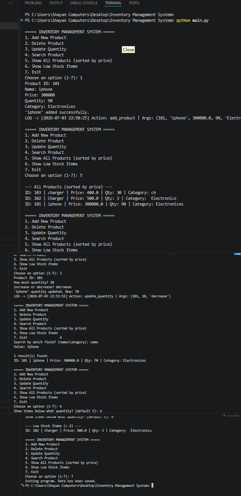

# 🧾 Inventory Management System (Python OOP Project)

A fully functional **Inventory Management System** built using Python and **Object-Oriented Programming (OOP)** concepts.
This project simulates a real-world backend system used for managing products, stock, and inventory operations efficiently.

---

## 🔗 Repository

GitHub: [Inventory-Management-system](https://github.com/Iram-Shahzadii/Inventory-Management-system)

---

## 🖥️ Demo



---

## ✨ Features

- ➕ Add new products with details (ID, name, price, quantity, category)
- ❌ Delete products by ID
- 🔄 Update product quantity (increase/decrease)
- 🔍 Search products (by name or category)
- 📊 Display all products sorted by price
- ⚠️ Low stock detection system
- 💾 Persistent data storage using JSON file
- 📝 Action logging system using decorators

---

## 🧠 Concepts Used

- Object-Oriented Programming (OOP)
- Classes & Objects
- Encapsulation
- File Handling (JSON)
- Exception Handling
- Decorators
- Generators
- Lambda Functions
- args/kwargs usage
- Data Structures (Dictionary, List)

---

## 🏗️ Project Structure

```
Inventory-Management-system/
│
├── main.py              # Program entry point (menu system)
├── inventory.py         # Core inventory logic (CRUD operations)
├── product.py           # Product class (data model)
├── decorators.py        # Logging decorator
├── inventory_data.json  # Auto-generated data file
├── log.txt              # Action logs
└── README.md
```

---

## ⚙️ Requirements

- Python 3.8 or higher
- No external libraries required — built entirely with Python's standard library (`json`, `os`, `datetime`, `functools`)

---

## ▶️ How to Run

```bash
# 1. Clone the repository
git clone https://github.com/Iram-Shahzadii/Inventory-Management-system.git

# 2. Move into the project folder
cd Inventory-Management-system

# 3. Run the program
python main.py
```

---

## 💡 What I Learned

This project helped me understand:

- Real-world software architecture using Python OOP
- Modular coding and clean project structure
- File-based data persistence
- Error handling in real applications
- Writing scalable and reusable code

---

## 🚀 Future Improvements

- Database integration (SQLite / MySQL)
- Web version (Flask / Django)
- REST API using FastAPI
- User authentication system
- Role-based access control

---

## 👩‍💻 Author

**Iram Shahzadi**
BS Computer Science Student
Passionate about Software Development, AI, and Problem Solving
